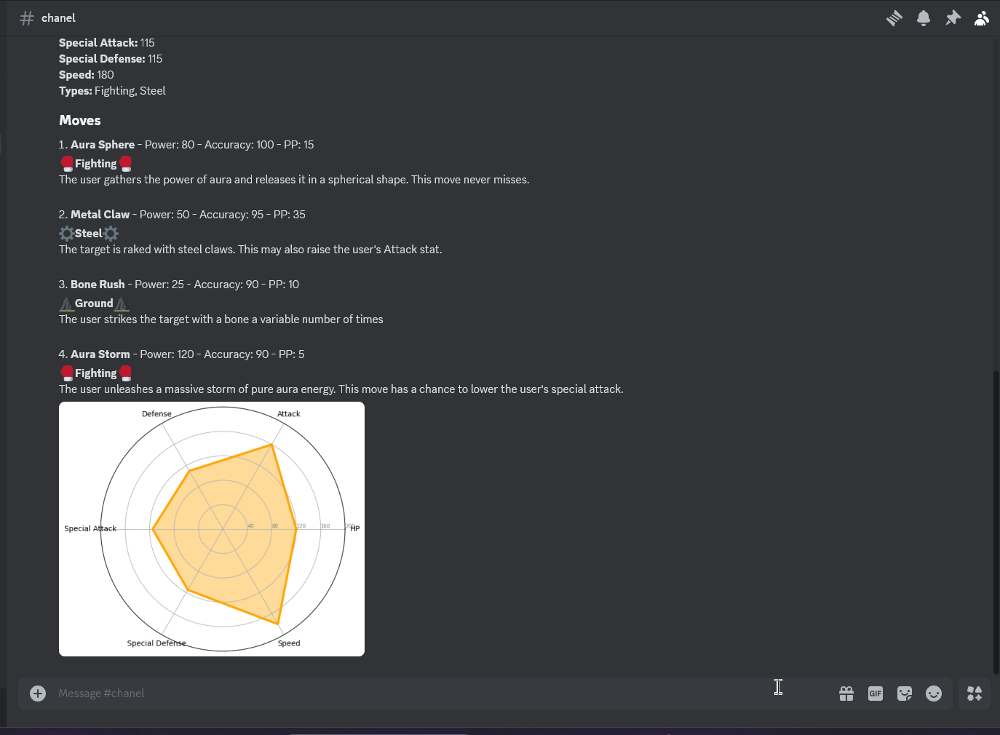

# What is it?

This is a bot for Discord. Its purpose is to create a real-life Pokédex entry based on the photos you provide.

# Getting Started

This project is built in Python. You also need Docker to test the application.

1. Clone the repository.
2. Rename **docker-compose.template.yml** to **docker-compose.yml** and change these environment variables:
   - DISCORD_TOKEN: Your Discord token. You need this to use this bot in Discord. For more info about how to create a Discord token, you can see [this article.](https://www.writebots.com/discord-bot-token/).
   - GOOGLE_API_KEY: Your Google Gemini API key. You need this to generate the entry based on your photo. For more info about how to create a Gemini API key, you can see [this article.](https://ai.google.dev/gemini-api/docs/api-key#windows)
3. You are ready to test on your own!